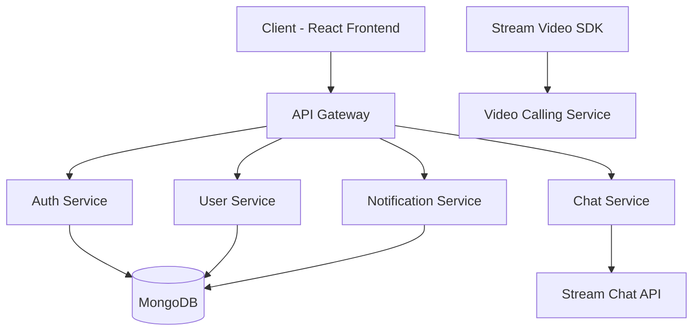
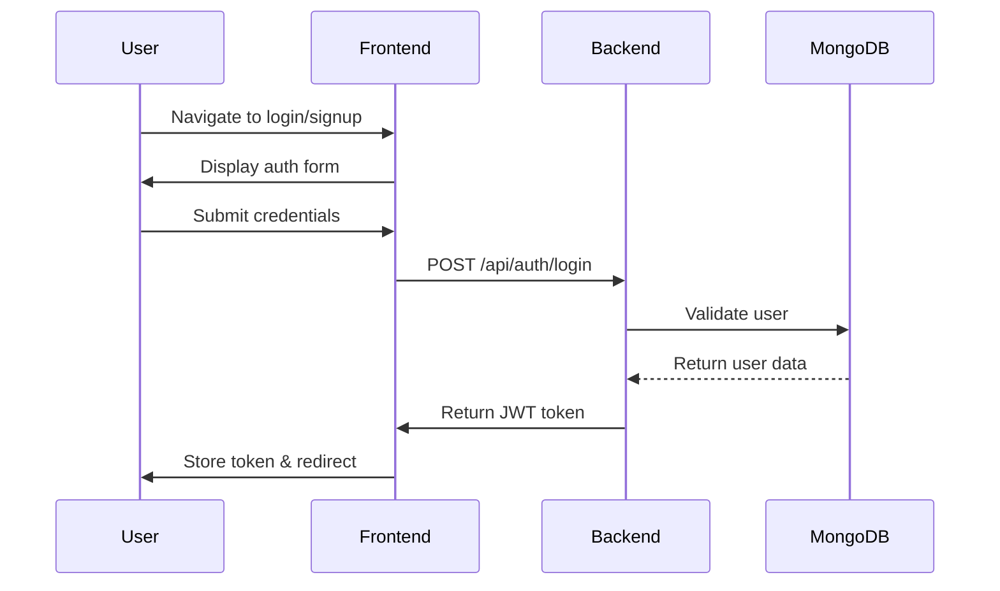
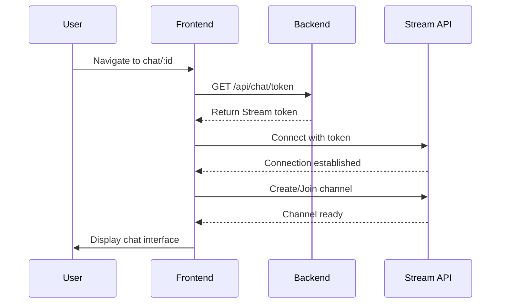
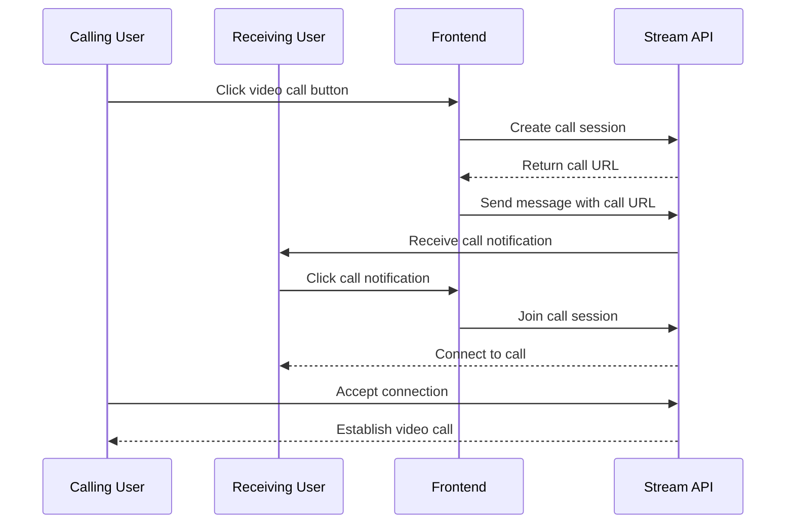

# Collab - Real-time Chat Application

[](https://nodejs.org/)
[](https://reactjs.org/)
[](https://www.mongodb.com/)


Collab is a modern real-time chat application built with React, Node.js, and MongoDB. It features user authentication, friend management, real-time messaging with Stream Chat API, and video calling capabilities.

## 🌟 Features

- **User Authentication**: Secure signup, login, and logout functionality
- **Friend Management**: Send, accept, and manage friend requests
- **Real-time Messaging**: Instant messaging powered by Stream Chat API
- **Video Calling**: Peer-to-peer video calls using Stream Video SDK
- **User Profiles**: Customizable profiles with avatars and personal information
- **Notifications**: Real-time notifications for friend requests and messages
- **Responsive Design**: Fully responsive UI for both desktop and mobile devices
- **Theme Support**: Multiple themes with persistent user preferences

## 🏗️ Architecture Overview

### High-Level Architecture



### Technology Stack

| Layer | Technology | Purpose |
|-------|------------|---------|
| **Frontend** | React 18 | UI Framework |
| | Vite | Build Tool |
| | Tailwind CSS | Styling |
| | DaisyUI | Component Library |
| | React Router | Navigation |
| | React Query | Server State Management |
| | Zustand | Client State Management |
| | Stream Chat React | Chat UI Components |
| | Stream Video SDK | Video Calling |
| **Backend** | Node.js | Runtime Environment |
| | Express.js | Web Framework |
| | MongoDB | Database |
| | Mongoose | ODM |
| | JWT | Authentication |
| | Stream Chat | Chat API |
| **Deployment** | Vercel | Frontend + API Hosting |
| | MongoDB Atlas | Database Hosting |

## 📁 Project Structure

```
Collab/
├── backend/
│   ├── src/
│   │   ├── controllers/     # Request handlers
│   │   ├── lib/            # Utility functions
│   │   ├── middleware/     # Express middleware
│   │   ├── models/         # Database models
│   │   ├── routes/         # API routes
│   │   └── server.js       # Entry point
│   ├── package.json
│   └── ...
├── frontend/
│   ├── src/
│   │   ├── components/     # Reusable UI components
│   │   ├── constants/      # Application constants
│   │   ├── hooks/          # Custom React hooks
│   │   ├── lib/            # Utility functions
│   │   ├── pages/          # Page components
│   │   ├── store/          # State management
│   │   ├── App.jsx         # Main app component
│   │   └── main.jsx        # Entry point
│   ├── package.json
│   └── ...
├── README.md
└── ...
```

## 🔧 Data Flow

### 1. User Authentication Flow



### 2. Chat Initialization Flow



### 3. Video Call Flow



## 🗄️ Database Schema

### User Model

| Field | Type | Required | Description |
|-------|------|----------|-------------|
| fullName | String | Yes | User's full name |
| email | String | Yes | Unique email address |
| password | String | Yes | Hashed password |
| bio | String | No | User biography |
| profilePic | String | No | Profile picture URL |
| nativeLanguage | String | No | User's native language |
| learningLanguage | String | No | Language user wants to learn |
| location | String | No | User's location |
| isOnboarded | Boolean | No | Onboarding completion status |
| friends | ObjectId[] | No | Array of friend IDs |
| timestamps | Date | No | Created/updated timestamps |

### FriendRequest Model

| Field | Type | Required | Description |
|-------|------|----------|-------------|
| sender | ObjectId | Yes | User who sent the request |
| recipient | ObjectId | Yes | User who received the request |
| status | String | No | Request status (pending/accepted/rejected) |
| timestamps | Date | No | Created/updated timestamps |

## 🚀 API Endpoints

### Authentication Routes (`/api/auth`)

| Method | Endpoint | Description |
|--------|----------|-------------|
| POST | `/signup` | Register a new user |
| POST | `/login` | Authenticate user |
| POST | `/logout` | Log out user |
| GET | `/me` | Get authenticated user |
| POST | `/onboarding` | Complete user onboarding |

### User Routes (`/api/users`)

| Method | Endpoint | Description |
|--------|----------|-------------|
| GET | `/` | Get recommended users |
| GET | `/friends` | Get user's friends |
| POST | `/friend-request/:id` | Send friend request |
| PUT | `/friend-request/:id/accept` | Accept friend request |
| GET | `/friend-requests` | Get incoming/outgoing friend requests |
| GET | `/outgoing-friend-requests` | Get outgoing friend requests |
| GET | `/:id` | Get user by ID |

### Chat Routes (`/api/chat`)

| Method | Endpoint | Description |
|--------|----------|-------------|
| GET | `/token` | Get Stream Chat token |

## 🎨 UI Components

### Core Components

| Component | Description |
|----------|-------------|
| Layout | Main application layout with sidebar and navbar |
| Navbar | Navigation header with user controls |
| Sidebar | Navigation menu for main pages |
| ChatPage | Full-screen chat interface |
| CallPage | Video call interface |
| HomePage | Main dashboard with friend recommendations |
| LoginPage | User authentication form |
| SignUpPage | User registration form |
| OnboardingPage | User profile setup |

### Feature Components

| Component | Description |
|----------|-------------|
| FriendCard | Display friend information |
| CallButton | Initiate video calls |
| ThemeSelector | Switch between UI themes |
| ChatLoader | Loading state for chat initialization |

## 🎯 State Management

### Client State (Zustand)

| Store | Purpose |
|-------|---------|
| useThemeStore | Manage UI theme preferences |
| useAuthUser | Manage authenticated user data |

### Server State (React Query)

| Query Key | Purpose |
|----------|---------|
| `["authUser"]` | Fetch authenticated user |
| `["streamToken"]` | Fetch Stream Chat token |
| `["user", id]` | Fetch user by ID |
| `["friends"]` | Fetch user's friends |
| `["recommendedUsers"]` | Fetch recommended users |
| `["friendRequests"]` | Fetch friend requests |

## 📱 Responsive Design

Collab implements a mobile-first responsive design approach:

### Desktop View
- Full sidebar navigation
- Expanded chat interface
- Multi-column layouts

### Mobile View
- Collapsed sidebar (accessible via hamburger menu)
- Full-screen chat interface
- Touch-friendly controls
- Simplified navigation

## 🔐 Security

- Password hashing with bcrypt
- JWT-based authentication
- CORS configuration
- Input validation and sanitization
- Secure cookie handling
- Environment variable configuration

## 🚀 Deployment

### Vercel Single-Project Deployment

Collab is configured to deploy as a single Vercel project:

1. Static frontend build from `frontend/dist`
2. Serverless backend API routed through `/api/*`
3. Vercel Cron for meeting reminder emails (`/api/internal/cron/meeting-reminders`)
4. MongoDB Atlas for database hosting

Project files used for Vercel deployment:

1. `vercel.json` for rewrites, output directory, and cron schedule
2. `api/index.js` as the serverless entrypoint that boots the Express app

Build command used on Vercel:

```bash
npm run build
```

### Environment Variables

| Variable | Description |
|----------|-------------|
| `MONGO_URI` | MongoDB connection string |
| `JWT_SECRET` | Secret key for JWT signing |
| `CRON_SECRET` | Secret used by Vercel Cron (`Authorization: Bearer <CRON_SECRET>`) |
| `FRONTEND_URL` | Public app URL (recommended for absolute meeting links) |
| `CLIENT_URL` | Optional explicit CORS allow-list origin |
| `STREAM_API_KEY` | Stream Chat API key |
| `STREAM_API_SECRET` | Stream Chat API secret |
| `SMTP_HOST` | SMTP host for meeting emails (default: `smtp.gmail.com`) |
| `SMTP_PORT` | SMTP port (default: `587`) |
| `SMTP_USER` | SMTP username/email |
| `SMTP_PASS` | SMTP password/app password |
| `NODE_ENV` | Environment (`development`/`production`) |
| `VITE_STREAM_API_KEY` | Stream API key for frontend |
| `VITE_API_BASE_URL` | Optional frontend API base URL override |

Notes:

1. For a single Vercel project, `VITE_API_BASE_URL` can be omitted (defaults to `/api`).
2. Set both production and preview environment variables in Vercel project settings.

## 🧪 Testing

### Frontend Testing
- Component unit tests with Jest
- Integration tests with React Testing Library
- End-to-end tests with Cypress

### Backend Testing
- Unit tests for controllers and middleware
- Integration tests for API endpoints
- Database operation tests

## 📈 Performance Optimization

- React.memo for component memoization
- Lazy loading for code splitting
- React Query caching
- Image optimization
- Bundle size optimization
- Database indexing

## 🤝 Contributing

1. Fork the repository
2. Create a feature branch
3. Commit your changes
4. Push to the branch
5. Open a pull request

## 🙏 Acknowledgments

- [Stream Chat](https://getstream.io/chat/) for real-time messaging
- [Stream Video](https://getstream.io/video/) for video calling
- [React](https://reactjs.org/) for the frontend framework
- [Tailwind CSS](https://tailwindcss.com/) for styling
- [DaisyUI](https://daisyui.com/) for component library
- [MongoDB](https://www.mongodb.com/) for database

## 📞 Support

For support, please open an issue on the GitHub repository or contact the development team.
